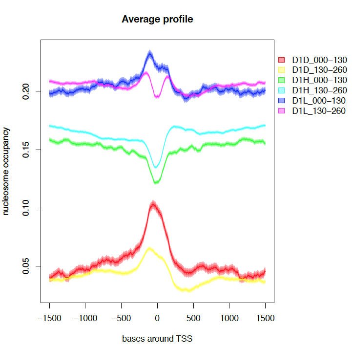
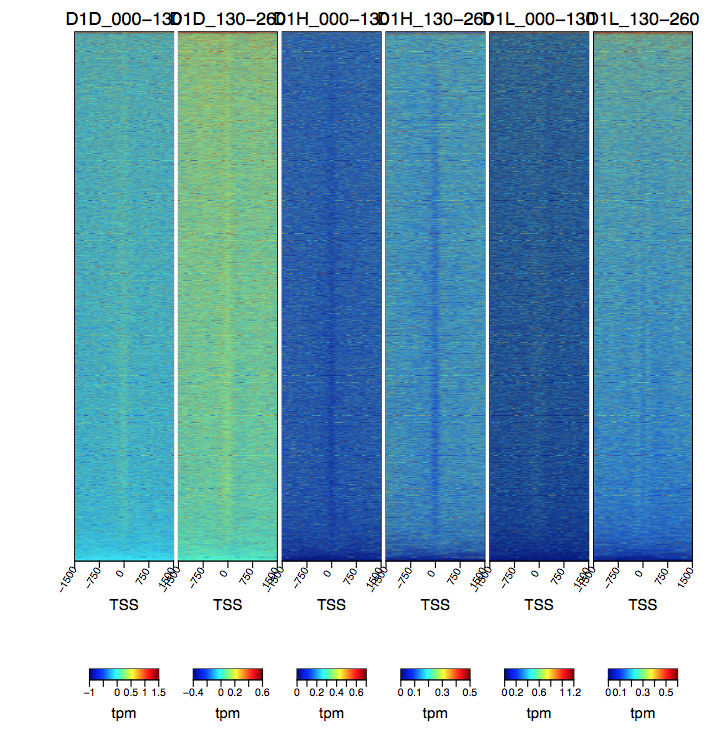
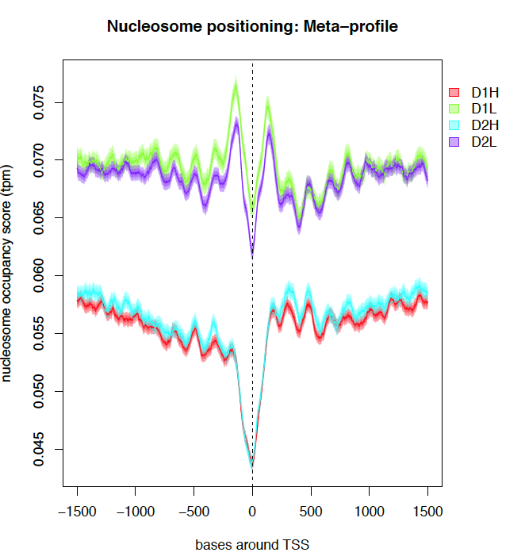
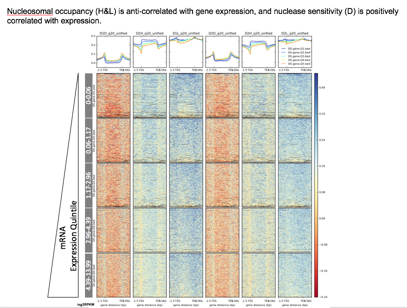
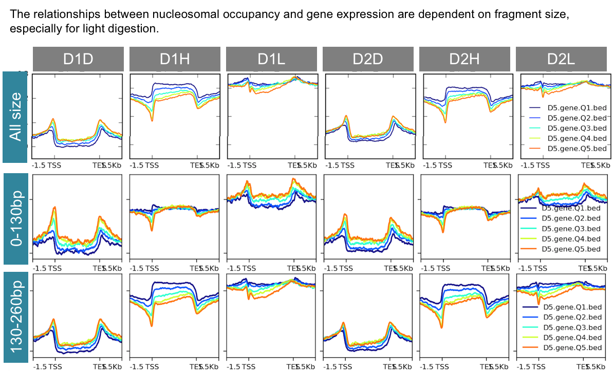
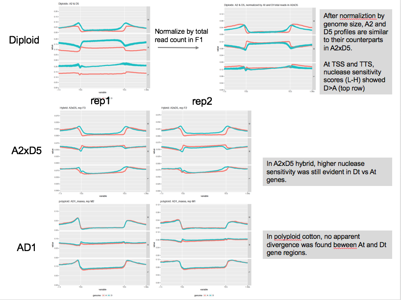

 # Results

**Outline**
    
- General description of MNase digestion and sequencing results: 
    - heavy and light digestion (gel image)
    - isolation and sequencing of nucleosomal DNA (size density plot)
    - mapping percentages using different reference genomes
    - coverage of genomic regions
    - two biological and technical replicates, how reproducible
    - size ranges 0-130 vs 130-160
- Examination of Nucleosomal OCcupancy (NOC) score and nucleosome center (dyads) positioning profiles
    - around genetic feature TSS and TTS (-1.5~1.5 kb)
        - for three size ranges: full, 0-130, 130-160
        - heavy and light using both replicates 
        - binned by expression percentiles.
- Linear model for explaining expression levels based nucleosome occupancy: to what extent can flanking regions of TSS and TTS predict expression levels? What about expression divergence between homoeologs?
- Intrinsic sequence properties  
    - GC content - correlation with NOC for 150bp nucleosome -sized region, do some random sampling (like 1-5% of genome) 
    - what about correlation with sequence predicted NOC
- Discovery of TFBS motifs
    - all possible 6-mer motifs (4^6= 4096): generate normalized NOC for 200bp region, is there negative correlation between GC content and NOC? how to detect 6-mer motifs with significantly lower NOC? Does it matter where to look at, promoter, distal, gene body?
    - scan for motifs in MSF and MRF with MEME and HOMER
- Examination of raw iSeg output
    1. 3 biological cutoffs (1,2,3) x 13/26 chromosomes Tables: number of a/+/- segments, region of segments.
    1. Distribution plots of segment width and ??significance
    1. Segment location: distal promoter (1-0.5 upstream of TSS), proximal promoter (500bp upstream of TSS), 5′ untranslated region (5′ UTR), CDS (coding sequences), intron, 3′ UTR, and TTS 3′ (500 bp downstream from TTS) regions.   

    

    

---

## Assessment of data quality

The percentage of MNase-seq reads that aligned to corresponding reference genomes ranges from 91% to 98%. Diploid cotton D5 reference genome outperformed other reference genomes for read alignments with Q>20: 80-86% D reads were mapped with Q>20, while for other reads 60-70% reads were mapped with Q>20.

Genomic coverage profiles of MNase-seq results were highly reproducilble between biological replicates (R2>0.9).

### 

## Heatmap and plot of meta-profiles of nucleosome occupancy scores around TSS

### From differential nuclease sensitivity profiling dataset
Take one biological replication of D-genome sample (D1) for example, nucleosome occupancy scores of Light (D1L) and heavy (D1H) digestion and their differences (D1D) were examined at 3kb surrounding 37223 TSSs annotated in reference D genome. MNase-seq fragments were partitioned into two size ranges, 0-130bp and 130-260bp.

A nucleosome "free" region was clearly shown in D1H and the 130-260bp fragments of D1L at TSS surrounded by -1 and +1 nucleosomes, as consistent with Mieczkowski et al (2016). For the sub-monomuclesomal size range of D1L, -1 and +1 nucleosomes appeared to be fused without an apparant "free" region.

The difference values of light and heavy digestions (D1D) exhibited a MSF signature around TSS in both size ranges.

### From nucleosme calling dataset

Next I plotted the nucleosome occupancy scores generated drom nucleoR analysis, which was processed to remove noise and amplify nucleome signals. The meta profile below showed clear nucleosome "free" region at TSS, flanked by well aranged nucleosome peaks.

### Nucleosomal occupancy profiles and nuclease sensitivity are associated with gene expression
Analyses based on all sequences without size partition.

### Divergence between diploids and between sub-genomes in allopolyploid cotton
Analyses based on all sequences without size partition.

